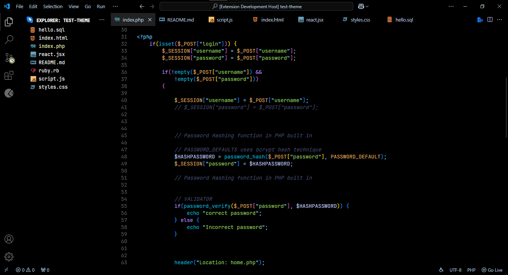
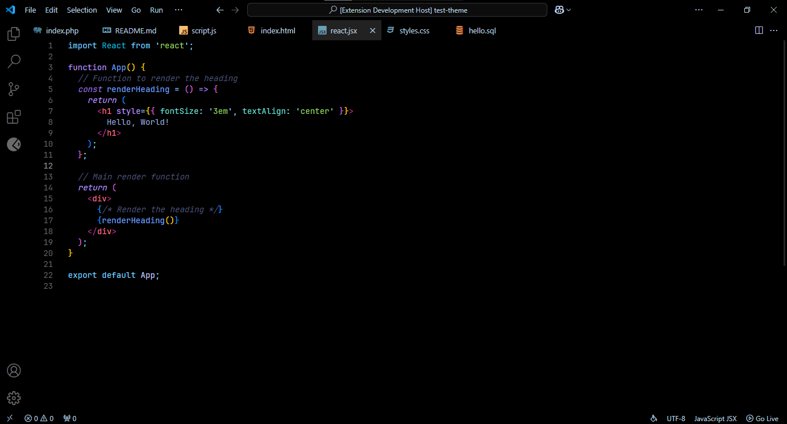
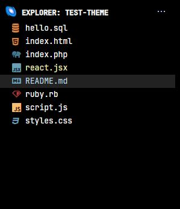
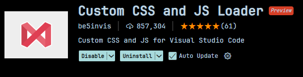

# [Tcker theme](https://marketplace.visualstudio.com/items?itemName=Tcker.tcker-theme)

[](https://marketplace.visualstudio.com/items?itemName=Tcker.tcker-theme)

## COMBINED WITH Tokyo Night Syntax Color & Jaakkko Black Color Theme ✨

<div align="center">

### Initial Demonstrations:

##### Initial Look 1: Php Language



#### Initial Look 2:



</div>

### DESCRIPTION

* I build this only for my eyes and my eyes only hahahhah
* I only copy the specific lines of codes to make this theme from their themes.json files

### Credits:
- https://github.com/tokyo-night/tokyo-night-vscode-theme 
- https://github.com/Jaakkko/vscode-black-theme

### TO RECREATE MY OWN CUSTOM FILE LIST LOOK:



- To recreate more foreground look with the Explorer this is would you need to do

1. **prerequisites:** <br>
    **A.** Download the extension **Custom CSS and JS loader** in vscode marketplace <br>
    

    **B.** Download **JetBrains Font**, and install them on your computer 

2. Create a custom directory for vscode-custom.css, create an import on your **settings.json**

```JSON

    "vscode_custom_css.imports": [
        "<path to your vscode-custom.css>",
    ],

```     

3. copy this code and paste it on your newly created vscode-custom.css

```CSS

.composite.title h2 {
    color: #FFFFFF !important;
    font-weight: bold !important;
    font-size: 12px !important;
}

.composite.title h2::before {
    display: inline-block;
    margin-right: 6px;
    font-size: 1.1rem;
    content: '🌌';
}

.monaco-list-rows {
    color: #FFFFFF !important;
}

```

4. You are welcome to customize your vscode base on your liking, **Happy Coding!**


**Enjoy!**
